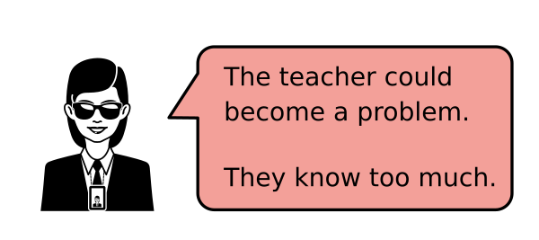
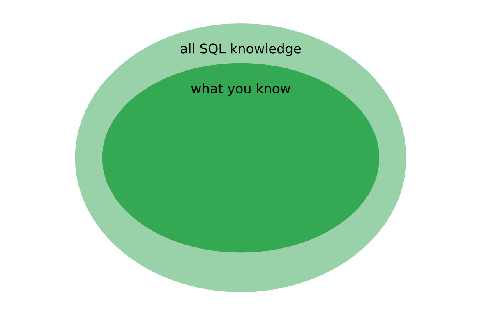
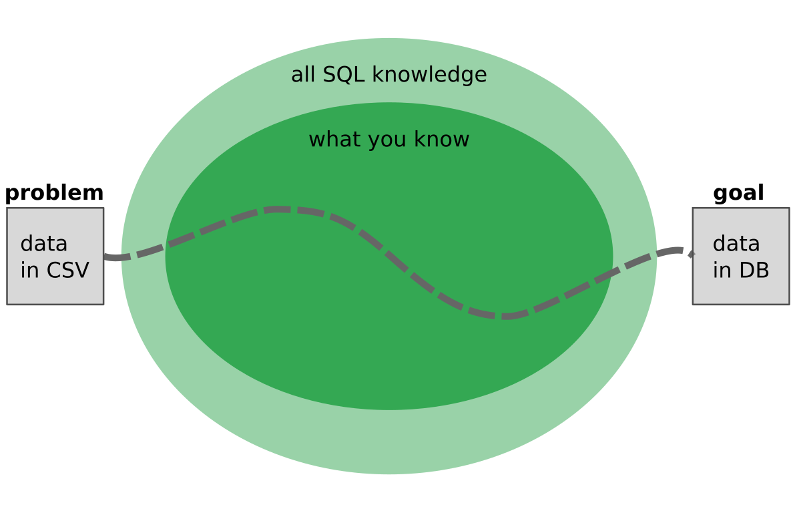
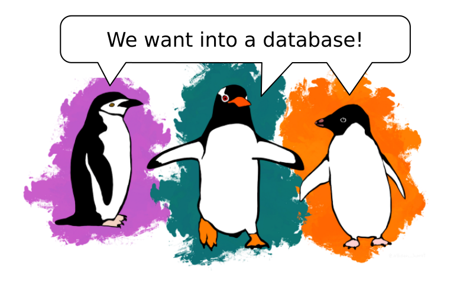
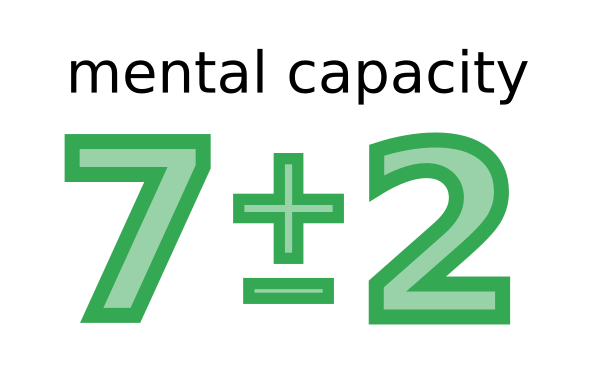
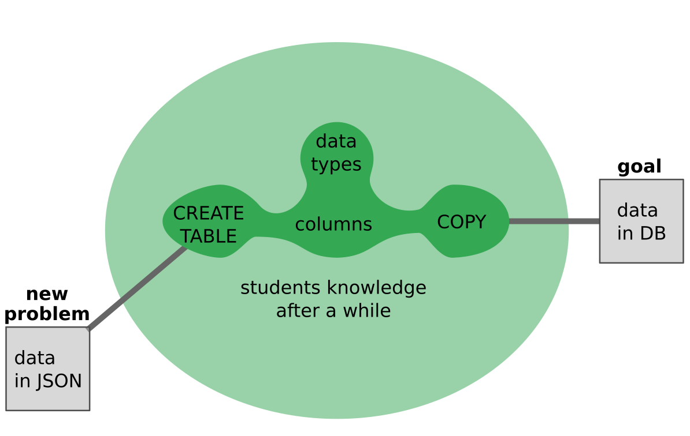
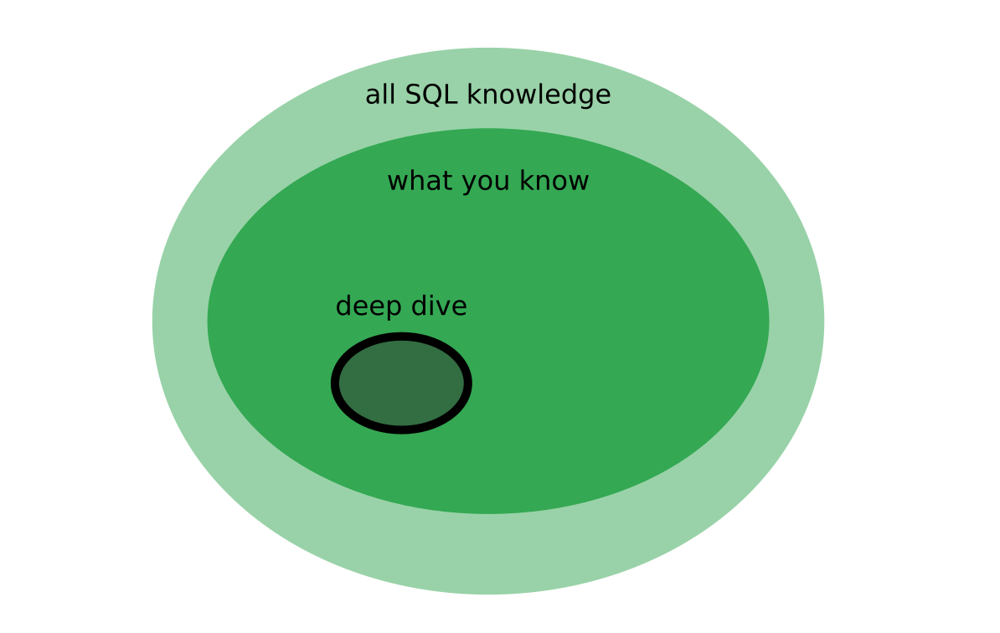

# Decide what to teach

## The Problem

You know much more than you can fit in one lesson.

or isn't that such a big problem after all?

**Surprise:** It is not about **You**. It is always about your **students**.

So the real question is: How can you make it count for them?

----

## The Solution

### 1. Find an interesting problem

Always use a tangible example to make the problem real:

*Palmerpenguins Artwork by @allison_horst*

### 2. Identify 5 +- 2 Stepping Stones

Literature says our mental capacity is

### 3. Leave away everything else

Leave out everything that does not belong to any your main concepts.

Students (or people in general) are very good at connecting dots and expanding to new problems.

### 4. Deep Dive Lessons

Deep Dive

