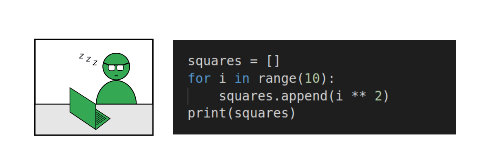

# How to create engaging coding exercises?

## The Problem

Suppose your students are to write a program
that calculates a series of square numbers:

    1  4  9  16  25  36  49  ...
  
IMAGE TEACHER CODE

    squares = []
    for i in range(10):
        squares.append(i ** 2)

    print(squares)

But if you show them a solution:

If you however ask them to write it themselves:

You also want more advanced students to try alternative implementations:

----

## Solution

### 1. Live Code

IMAGE GURU

wait for them

super slow

almost no preparation

### 2. Reduced Examples

Give them an incomplete solution

IMAGE BUGS MIX GAPS TRANSFER

To create these, create a complete solution first and omit parts.

Faded Examples https://teachtogether.tech/en/index.html#s:architecture-load

### 3. Step-by-Step

Provide a step-by-step recipe that tells students exactly what to do.

Better for a longer exercise.

This is more work, but it is simpler to do.

IMAGE BONUS EXTRA GAUGE
