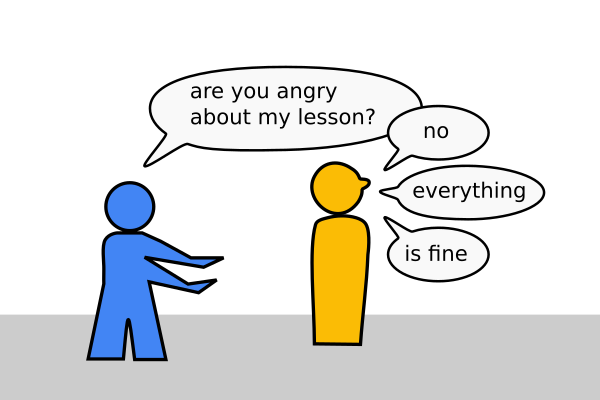

# How to get instant feedback from students?

IMAGE PENGUIN HOW WAS MY BASH LESSON?

## The Problem

You have **no idea** what is going on in your class.

.. or worse, you **know** something is going on:

.. or everything is great and you would like to slow down and **reflect**:

IMAGE CAMPFIRE

----

## Solution

Select one strategy:

### A: Single Choice Quiz

Asking 3 questions on the subjects from the last lesson is a low-risk strategy:

IMAGE CHMOD

also works as a True/False quiz

IMAGE SLACK

You learn how much into the subject your students are.

-> Slack, Polly

### B: Collect ideas

Collect ideas in an online app

Let students see the results:

IMAGE 3 QUESTIONS

-> Slack, Funretros, Spreadsheet

IMAGE TEMP CHECK

good to let off some pressure in a controlled manner.

### C: Prioritize ideas

dot-voting on ideas

IMAGE BAR PLOT

also works on slack, socrative

### D: Lean Coffee

IMAGE COFFEE

up to 8 people
needs time

if you have conflicts boiling may make them worse, lean coffee

### WARNING

Most feedback

### Further Reading

https://www.funretrospectives.com