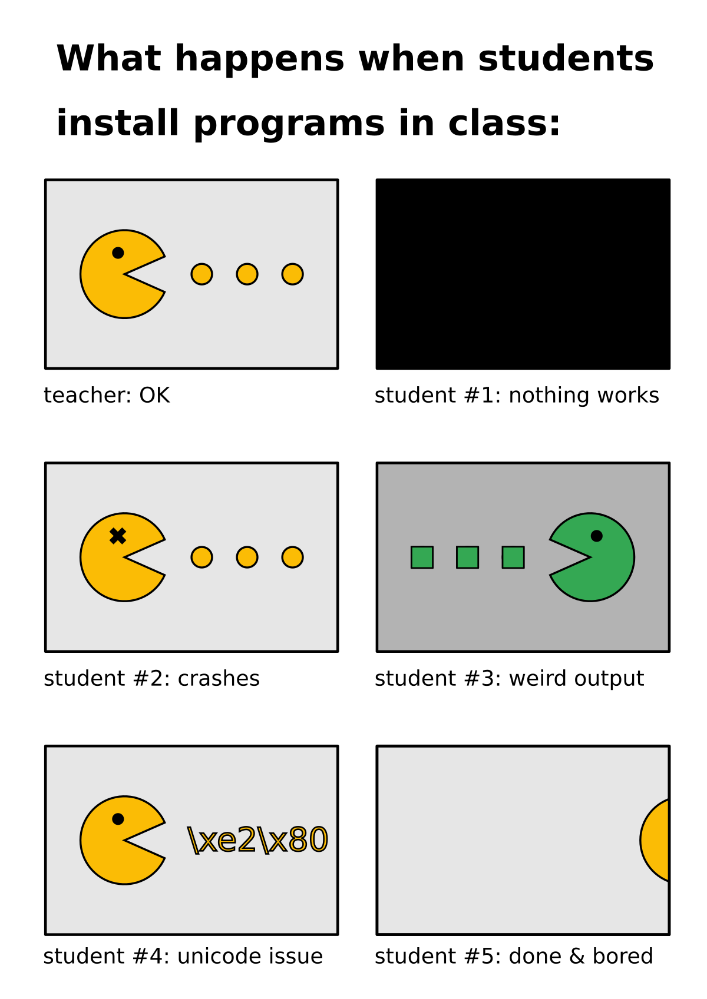

# How to prevent Installation Failure?

## The Problem

You prepared a nice, easy and fun example program.
Everything works fine, but then your lesson starts:

If you fix everything in class, half the day will be over.

IMAGE TEACHER DOESNT HAVE TIME

How to make installation issues go away?

----

## The Solution

### 1. Control the flow of events

IMAGE EVENT TIMELINE

You want to decrease the number of failing student computers.

* Self-paced exercise for others 

IMAGE DECAY

If you get 90% working in a short time, it is good already.

### 2. Create a checklist

Write a simple checklist that students

IMAGE CHECKLIST

Make sure that your students can check the points without you.

This makes many of the questions *"does it work already?" go away.

### 3. Have a Plan B

* Docker
* Cloud
* Team up
