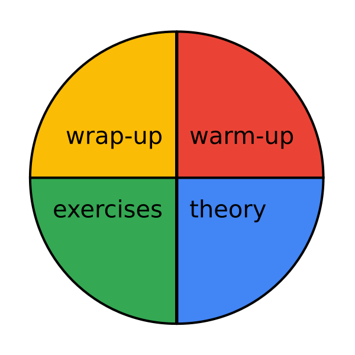

# How to save preparation time?

## The Problem

You can spend a lot of time preparing lessons:

When should you stop?

----

## Solution

Here you find tools that get your preparation straight to the point.

### 1. Problem

Theme + Data

### 2. Visual Overview

### 3. Code

Write a complete solution first

also see 

### 4. Questions

Prepare a few questions:

*
*
*

also see: interview questions

### 5. Further Reading

2-4 links to web pages, blog posts or videos that explain the main concepts.
You could use these for a research activity as well.

### 6. Write a lesson plan

TABLE LESSON PLAN

### 7. Create Materials

Often you need much less than you think.
