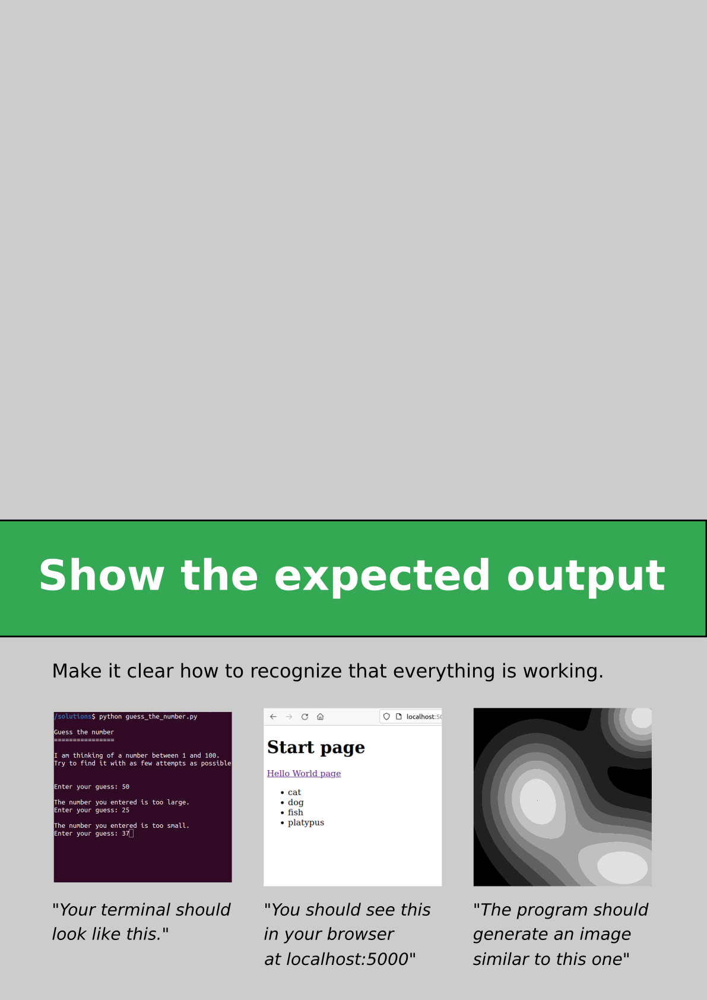
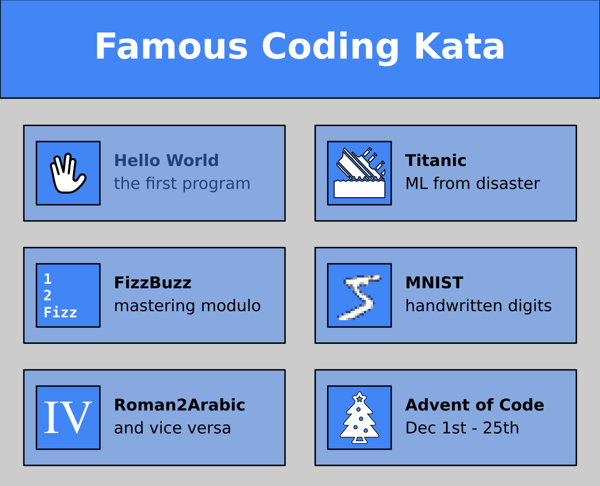

# How to select material for self-study?

## The Problem

Your students are to become good at something.

In teaching, time is always too short to reach mastery.

**So how can you help them?**

----

## Solution

### 1. Show a learning path

Many self-paced online courses do this.

The main point of having a path is that it gives your student a **direction** 

### 2. Reading Material

LINK DVGODOY: https://github.com/dvgodoy/ML_Fundamentals

### 3. Write Exercises

For self-study, you need a complete step-by-step guide.
It does not have to be a literary masterpiece

Full Stack open: https://fullstackopen.com/en/

### 4. Kata

Easy to write

