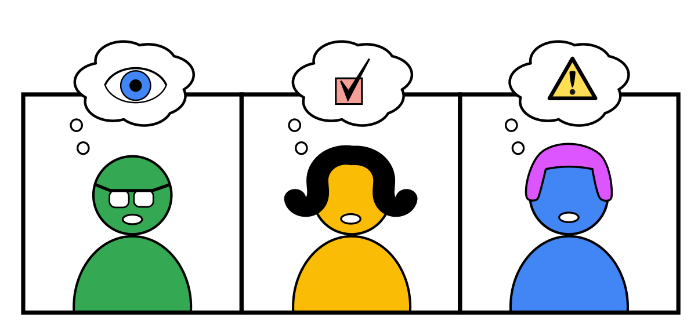
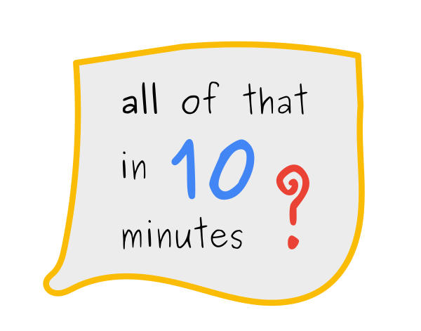
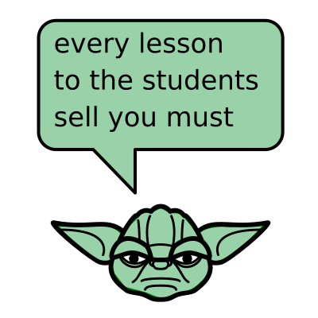
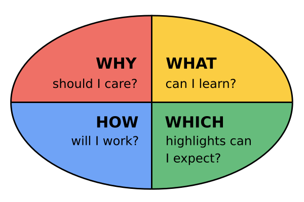

# How to start an online lesson?

## The Problem

You want to:

### Get the full attention of your students

### Build authority and rapport

### Make them talk about the subject

... all of that in the first 10 minutes

----

## Solution

IMAGE BIKE DRIVING ALONG A TIME SERIES

### 1. Arrive Early

Be there 10 minutes earlier at least.

Conduct a tech-check with the first attendant.

IMAGE CAN YOU HEAAAAR ME?

Chat a little, get to know them a bit. 
Genuine starter question in a course where you come in for a Masterclass: What did you learn yesterday?

When it is time to start, start.

### 2. Sell your lesson in 2 minutes

Answer 4 questions:

### 3. Prime

*Priming: dictionary definition*

IMAGE PRIMING

* share a bicycle story

### 4. Recap

*on day 2*

Five Line Challenge: ACADEMIS

PASTE EXAMPLE HERE
