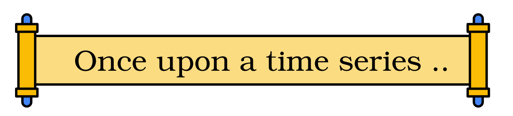
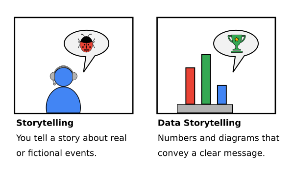
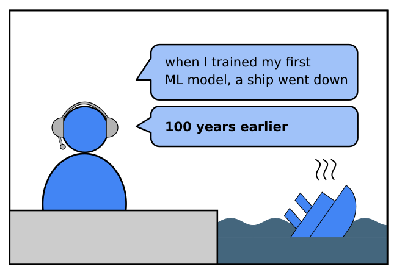
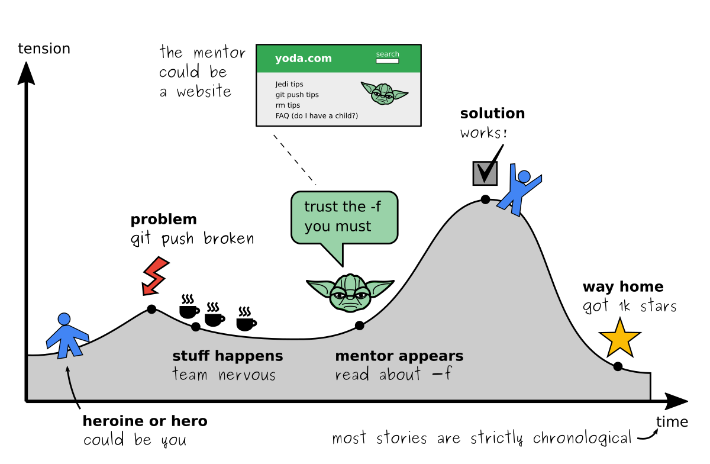
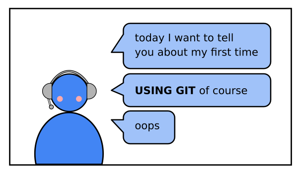
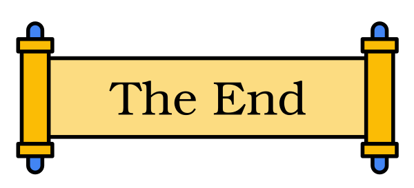

# How to use storytelling?

## The Problem

----

## Solution

Start a new topic or sub-topic with a short story.

### 1. Draw from your experience

You are the expert. You have been in situations that your students have no idea about.
This makes it easy to craft a story. It does not even have to be a particularly good story

Think about:

* the first time you used the technology you want to teach
* exciting moment in a project
* spectacular failures
* bugs

Then tell what happened. Plain and simple. That is enough. No fireworks needed.

You can even tell about your experience in something super common like [the Titanic challenge on Kaggle](https://www.kaggle.com/c/titanic) as long as you find something that is new for the students.

### 2. The "Hero Journey" Structure

Stories are strictly chronological.

time: 5'

### 3. Good Stories are short

You may want to rehearse your story one or twice or write it down.

    example git story

Check out the teachings of [Master Foo](http://catb.org/esr/writings/unix-koans/ten-thousand.html) although they are a bit ancient.

LINK HERO JOURNEY

