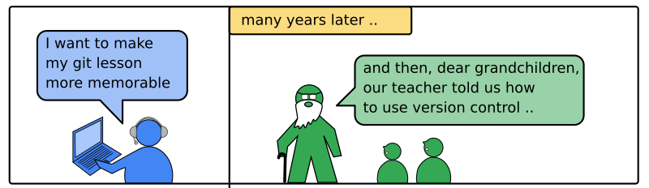

# How to use storytelling?

## The Problem

----

## Solution

Start a new topic or sub-topic with a short story.

### 1. Reach into your experience

You are the expert. You have been in situations that your students have no idea about.
This makes it easy to craft a story. It does not even have to be a particularly good story

Think about:

* the first time you used the technology you want to teach
* exciting moment in a project
* spectacular failures
* bugs

Then tell what happened. Plain and simple. That is enough. No fireworks needed.

IMAGE FIRST TIME

### 2. The "Hero Journey" Structure

Stories are strictly chronological.

IMAGE HERO JOURNEY

### 3. Good Stories are short

IMAGE 5' CIRCLE

git story

LINK MASTER FOO
LINK READ 

