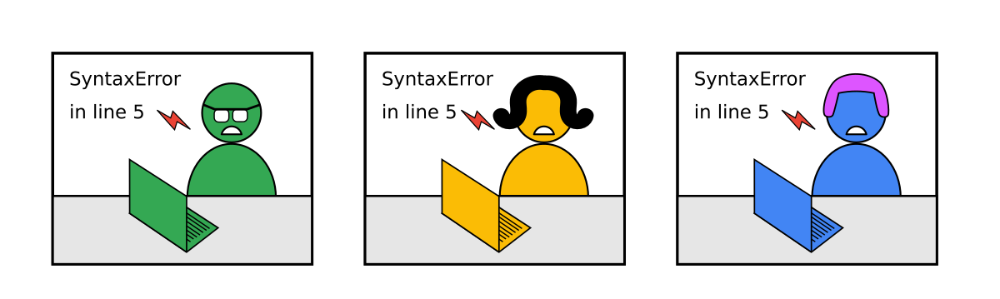
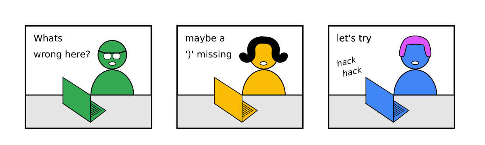
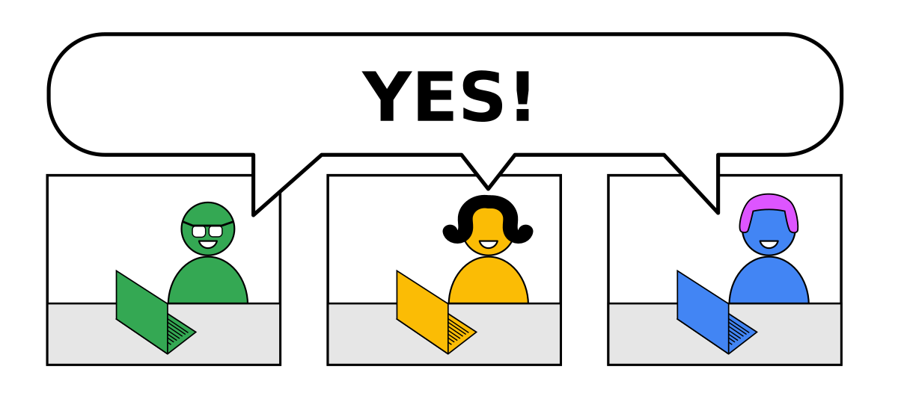

# How to encourage students to work together?

## The Problem

You want to convert disconnected students:

into a group:

so that:

However, in an online class, this rarely happens by itself.

Students feel *psychologically safe* on their own

IMAGE SAFE BOX

----

## Solution

### 1. Check the technical setup

IMAGE CHECKLIST

Can't you try in class?

IMAGE YODA TRY

An online group is very sensitive to little bumps.
If something does not work out it takes out momentum.

### 2. Establish rules

IMAGE STILL SAFE RULES TASK TIMEBOX 

### 3. Short taks are easier

IMAGE SHORT TASKS

### 4. Longer tasks in groups

IMAGE GROUPS

TRICK TOO EASY
