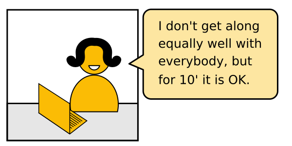

# How to encourage students to work together?

## The Problem

You want to convert disconnected students:

into a group:

so that:

However, in an online class, this rarely happens by itself.

Students feel *psychologically safe* on their own

----

## Solution

### 1. Check the technical setup

An online group is very sensitive to little bumps.
If something does not work out it takes out momentum.

### 2. Establish rules

### 3. Short taks are easier

### 4. Longer tasks in groups

TRICK TOO EASY
